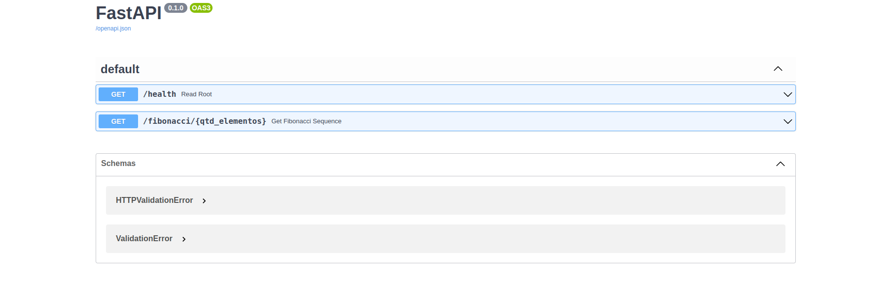

# API com FastApi

Este é um projeto simples que fornece uma API para calcular sequências de Fibonacci usando FastAPI. Você pode usar o Docker para implantar e executar este projeto facilmente.

## Pré-requisitos

Antes de começar, certifique-se de que você tenha o Docker instalado no seu sistema.

## Como Usar

Siga as instruções abaixo para executar o projeto:

1. Clone este repositório:

    ```bash
    git clone https://github.com/Gefte/backend-fastapi.git
    ```

2. Navegue para o diretório do projeto:

    ```bash
    cd backend-fastapi
    ```

3. Construa a imagem Docker:

    ```bash
    docker build -t backend-fastapi .
    ```

4. Execute o contêiner Docker:

    ```bash
    docker run -d -p 80:80 backend-fastapi
    ```

Agora, a aplicação está em execução e pode ser acessada em `http://localhost:80`.

## Documentação da API

Você pode consultar a documentação da API em tempo real visitando o seguinte URL:

http://localhost:80/docs

A documentação fornecerá detalhes sobre todos os endpoints disponíveis, bem como exemplos de usar.



## Endpoints da API

### Verificar o serviço

Você pode verificar se o serviço está funcionando corretamente acessando:

GET http://localhost:80/health


Você deve receber a resposta: `{"Estou saudavel"}`.

### Calcular a sequência de Fibonacci

Para calcular a sequência de Fibonacci com base no número de elementos desejados, use o seguinte endpoint:

GET http://localhost:80/fibonacci/{qtd_elementos}


Substitua `{qtd_elementos}` pelo número desejado de elementos na sequência. Por exemplo:

GET http://localhost:80/fibonacci/10

Você receberá a sequência de Fibonacci correspondente.

